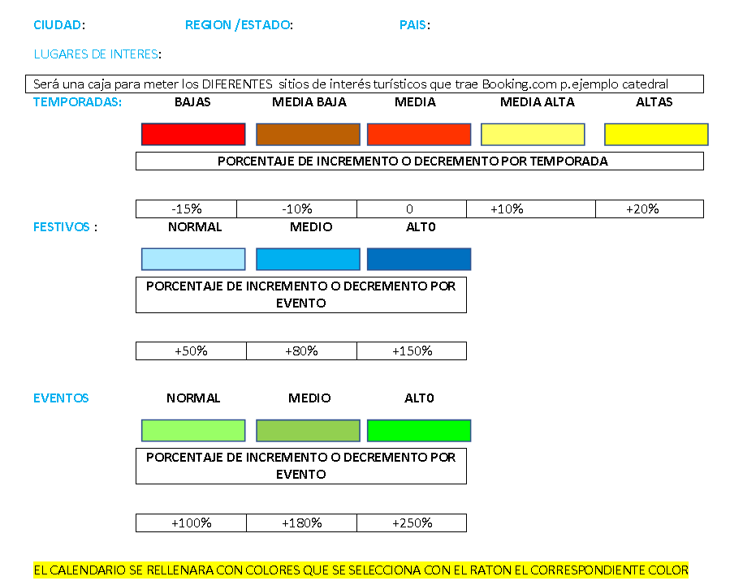

# yii-calendario-eventos
Corresponde de tarea calendario

La tarea consistía en hacer una elección en el calendario por tipo de temporada, evento o día festivo, de modo que los días seleccionados fueran coloreados y mostrados en forma de calendario.

El trabajo utilizado: 
<ul>
  <li>Yii 2 Basic</li>
  <li>year-calendar/js-year-calendar</li>
</ul>

He desarrollado dos páginas: una página de configuración, donde puede establecer el nombre del objeto y su marcado. También agregué un precio para todas las temporadas para que puedas ver el trabajo de los cargos adicionales. 
En la segunda página, realicé una visualización simple de los precios del objeto en el calendario, teniendo en cuenta los márgenes por temporadas.

La base de datos no se usa por simplicidad, todo se almacena localmente en un archivo .json .

